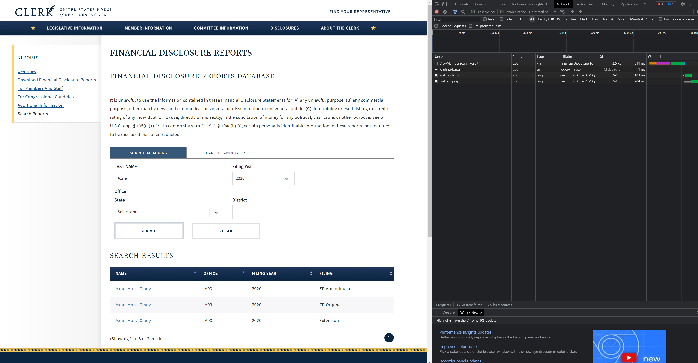
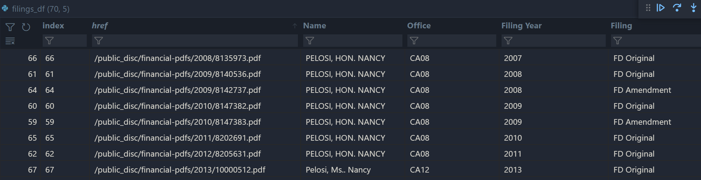

+++
title = "Scraping financial discloure reports from the House of Clerks website with Python - Part 1: Downloading the reports"
description = "Part 1 of a series on acquring and scanning House of Clerks financal disclosures using Python. Covers the downloading of the files using BeautifulSoup and requests."
date = 2022-01-09
updated = 2022-01-09
draft = false

[taxonomies]
tags = ["Web Scraping","Python"]
[extra]
math = true
math_auto_render = true
comments = true
+++

# Introduction

As per the [Ethics in Government Act of 1978](https://en.wikipedia.org/wiki/Ethics_in_Government_Act) members of public office in the US are required to fill in forms disclosing most forms of income, including trading, property and gifts. These forms are publically available on the [Office of the Clerk's](https://disclosures-clerk.house.gov/PublicDisclosure/FinancialDisclosure#Search) website.

The end goal of this series of blogs is to have code that will automatically download these forms and scan the contents into a tabular form. This data can be used to get insight into the income types of US politicians - something that could be interesting would be to do some backtesting based on their investment portfolios.

# Listing & downloading financial disclosures

The easiest way to figure out how to get the PDFs programatically is to use the developer tools within Google Chrome to track the requests being made when you query and download the financial disclosure forms.

To start we go to [query tool](https://disclosures-clerk.house.gov/PublicDisclosure/FinancialDisclosure#Search) provided by the Office of the Clerk's website. In Chrome, right click and hit "inspect". Go to the network tab. Type in a name and hit "search".



Look for the XHR response, click on it and look at the request URL and payload. We will need to include these when we emulate the request in Python. The HTML in the response body is what we will use to get a list of URLs pointing to the individual financial disclosure PDFs.

## Making the query request and parsing the response

Making requests of this type is extremely simple in Python using the `requests` library. The payload will be passed into the request using a `dict` - the fields (which are all optional) are *LastName*, *FilingYear*, *State* and *District*. For now I'll just give people the option to specify a *LastName*.

```python
import requests
from bs4 import BeautifulSoup

base_url = "https://disclosures-clerk.house.gov/PublicDisclosure/FinancialDisclosure/"

def clerk_request(member_lastname=None) -> BeautifulSoup:  
    """
    Makes a request to the Office of the Clerk's website for member financial
    disclosures
    
    Parameters
    ----------
    member_lastname: str or None, default None
        Member to get filings of. If None gets all data.
    
    Returns
    -------
    Response
        BeautifulSoup: Souped HTML response of request to clerk query tool.
    """
    endpoint = base_url + "ViewMemberSearchResult"
    if member_lastname is None:
        clerk_response = requests.post(endpoint)
    else:
         clerk_response = requests.post(endpoint, data ={"LastName": member_lastname})
    clerk_response.raise_for_status()
    souped_response = BeautifulSoup(clerk_request.text, "lxml")
    return souped_response
```
We're using `BeautifulSoup` to parse the HTML body of the response into a tree representation for easy traversal. The HTML has an embedded table with the following structure.

```html
...
<tbody>
    <tr role="row">
        <td data-label="Name" class="memberName">
            <a href="/public_disc/financial-pdfs/2013/9106227.pdf" target="_blank">Pelosi, Hon.. Nancy </a>
        </td>
        <td data-label="Office">CA12      </td>
        <td data-label="Filing Year">2013</td>
        <td data-label="Filing">FD Amendment</td>
    </tr>
    <tr role="row">
        <td data-label="Name" class="memberName">
            <a href="/public_disc/financial-pdfs/2013/10008188.pdf" target="_blank">Pelosi, Hon.. Nancy </a>
        </td>
        <td data-label="Office">CA12</td>
        <td data-label="Filing Year">2013</td>
        <td data-label="Filing">FD Amendment</td>
    </tr>
    ...
</tbody>
...
```
We can see the links to the PDFs, as well as interesting information we will need to extract such as the filing year and what type of disclosure it is. We can extract this by querying the BeautifulSoup tree for HTML tags, starting from the top (the `<tr>` tag) and working our way down.

```python
def clerk_filings(member_lastname=None, filing_range: int=2014) -> pd.DataFrame: 
    
    """
    Parses member filing data into a DataFrame. 
    
    Parameters
    ----------
    member_lastname: str or None, default None
        Member to get filings of. If None gets all data.
    
    filing_range: Int, default 2014
        Date range of filings to grab. Defaults to 2014,
        when electronic filing was introduced.
    
    Returns
    -------
    pd.DataFrame
        HTML table from clerk request parsed into a DataFrame
    """
    
    table_collection = []

    souped_response = clerk_request(member_lastname=member_lastname)

    for table_row in souped_response.find_all('tr'):
        row = {}
        for table_cell in table_row.find_all('td'):
            link_field = table_cell.find('a')
            if link_field:
                row.update({'href': link_field.get('href'), table_cell.get('data-label'): table_cell.text})
            else:
                row.update({table_cell.get('data-label'): table_cell.text})
        if row:
            table_collection.append(row)
    
    filings_df =  pd.DataFrame(table_collection)
     
    filings_df["Filing Year"] = filings_df["Filing Year"].apply(lambda x: int(x))
     
    return filings_df[filings_df["Filing Year"] >= filing_range]
```
The above function returns something that looks like the below:



We enforce that the filing year must be above 2014 - PDFs from years earlier than this tend to be handwritten and scanned, making them very hard to extract information from.

## Downloading the PDFs

Now that we have a `DataFrame` with all the endpoints we need to download the individual PDFs we can begin. If you click on one of the PDFs you will see the respone URL are structured like `https://disclosures-clerk.house.gov/public_disc/<filing-type>/year/<filing-id>.pdf`. We get everything after the base URL from our filing DataFrame.

The code below has a function to obtain the byte representation of the PDF file and then convert that into a tuple, the first element being metadata (i.e. page/file size) and the second being an array of PIL images representing the pages of the PDF.


```python
def image_from_endpoint(endpoint: str) -> Tuple:
    """
    Gets PIL image objects from the PDF at the given endpoint.
    
    Parameters
    ----------
    endpoint: str
        Endpoint PDF is located at.

    Returns
    -------
    Tuple
        First elem is image metadata, second elem is array of PIL images for
        each page in PDF.
    """
    base_url = "https://disclosures-clerk.house.gov"
    pdf_response_obj = requests.get(base_url + endpoint)
    pdf_response_obj.raise_for_status()
    pdf_info = pdf2image.pdfinfo_from_bytes(pdf_response_obj.content)
    pdf_pages = pdf2image.convert_from_bytes(pdf_response_obj.content)
    return (pdf_info, pdf_pages)
```

Putting this all together we can map the filings to a list of images representing the PDF file and save the first one.

This can be done as below (i've put all the functions in a module for clarity):

```py
import mod.download as dl

filing_df = dl.clerk_filings("Pelosi")
# We are only interested in FD Originals for now
# Filter the endpoint dataframe so we only send a reqeust 
# for 1 report for now
df_filtered = filing_df[filing_df["Filing"] == "FD Original"][0]
# Map endpoint -> list of images
df_filtered = df_filtered.assign(images=filing_df["href"].apply(lambda x: dl.image_from_endpoint(x)))
# Take the first PDF
metadata, images = df_filtered["images"].iloc[0]
# Take the first page of the first PDF
first_page = first_pdf[0]
first_page.save("../output/example.png")
```
If you now open `example.png` you'll see something like

.

We'll conlude here - to extend this process you'll need to obtain a list of member last names to loop over, and then loop over the PDF images that are returned. In the [next](@/posts/financial-disclosure-p2/index.md) blog we'll to some preprocessing on the image we've obtained using `opencv` to get it ready for text extraction and clustering.