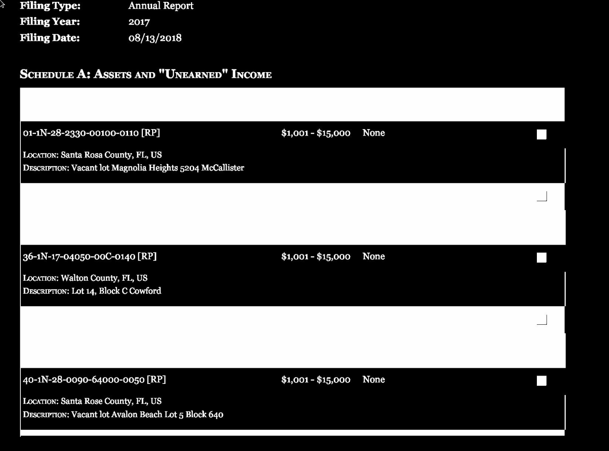
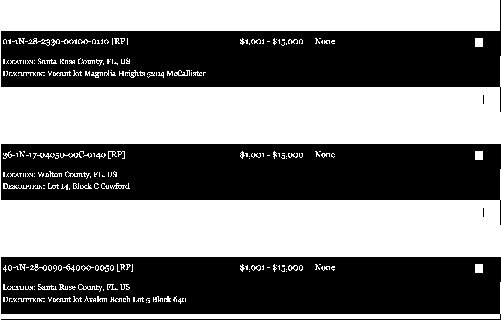
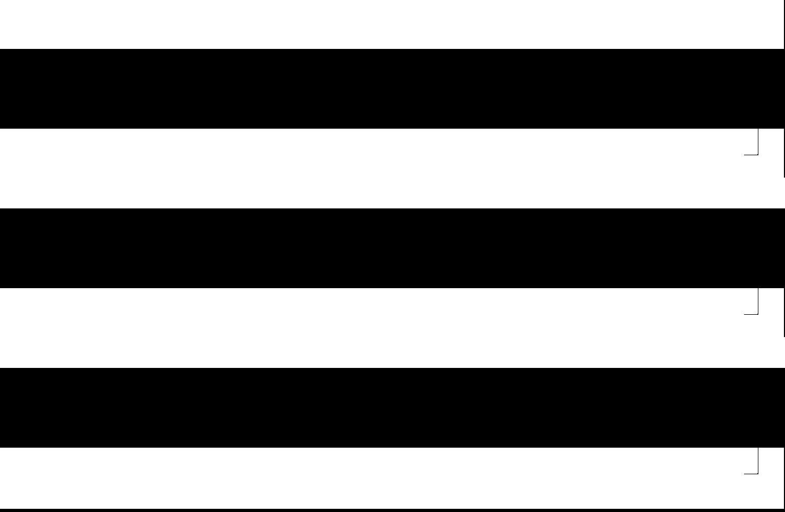
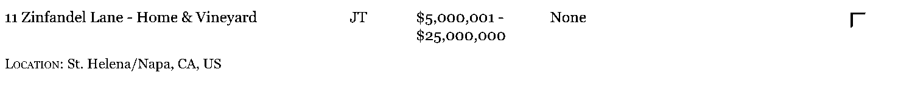
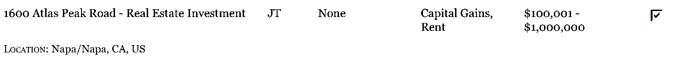

+++
title = "Scraping financial disclosure reports from the House of Clerks website with Python - Part 2: Contour detection and table preprocessing using opencv"
description = "Part 2 of a series on acquiring and scanning House of Clerks financal disclosures using Python. Covers pulling the table from the PDFs using contour detection and splitting it out into rows using morphological operations."
date = 2023-05-26
updated = 2023-05-26
draft = false

[taxonomies]
tags = ["Computer Vision","Python"]
[extra]
math = true
math_auto_render = true
comments = true
toc = true
+++

# Introduction

In the [previous](@/posts/financial-disclosure-p1/index.md) article I covered how to automate the downloading of financial disclosure reports from the US House of Clerks website. We are now doing to some preprocessing on these forms to get them ready for text extraction and clustering, which is how we're going to parse the forms into tabular dataset.

# Converting the image to BGR colour space

If you followed along the last article (or by grabbing the code from the repo [here](https://github.com/jamiegl/financial-disclosure-scraper)) you can run the below to load the image into a format (it'll be an a bunch of numpy arrays) ready for opencv to operate on.

```py
import mod.download as dl

filing_df = dl.clerk_filings("Gaetz")
df_filtered = filing_df[filing_df["Filing"] == "FD Original"]
df_filtered = df_filtered.assign(images=filing_df["href"].apply(lambda x: dl.image_from_endpoint(x)))
first_pdf = df_filtered["images"].iloc[0][1]
first_page = first_pdf[0]
form_opencv = cv2.cvtColor(np.array(first_page), cv2.COLOR_RGB2BGR)
```

Everything apart from the last line is explained in the previous article - this line translates our image to the BGR colour space, which is needed when working with opencv (for purely [historical](https://stackoverflow.com/questions/14556545/why-opencv-using-bgr-colour-space-instead-of-rgb) reasons).

If you didn't follow the last article and just want to start from here, save the form from the next section and open it with:

```py
form_opencv = cv2.imread("path/to/image.png", cv2.COLOR_RGB2BGR)
```

# Contour detection pass - pulling the table from the surrounding form

The form we are working with is shown below:


All financial disclosure take the same form as above, with multiple pages of tables with surrounding text we arent interested in (we can get alot of this surrounding information from the HTML parsing we did in the previous article).

To pull the tables out of the forms we will use the contour detection capabilites of opencv. Contour detection is a way of finding the edges of objects in an image, which is a fundamental part of computer vision which is often interested in identifying objects of interest from within a larger image. 

To begin we need to do a little image preprocessing to make life easier for the contour detection algorithim. When doing this kind of work you're going to need to write the images you generate out to a file for quick inspection whilst you make changes. A little function that does this is shown below:
```py
# for quickly saving images for inspection
def si(array, path="../outputs/tmp/temp.png"):
    Image.fromarray(array).save(path)
```
I normally have vscode/[ranger](https://github.com/ranger/ranger) open on another screen with the file `../outputs/tmp/temp.png` open. Whenever I want to an see image looks like I just run `si(<my_image>)` and inspect the result on my other screen. 

Lets begin preprocessing. We want to make the edges of our table very "obvious" - there should be alot of contrast within our image. For us this is very easy - our image is grey, white and black so we'll just apply a threshold function to make it black and white.

```py
gray_img = cv2.cvtColor(form_opencv, cv2.COLOR_BGR2GRAY)
(thresh, thresh_img) = cv2.threshold(gray_img, 250, 255, cv2.THRESH_BINARY_INV)
```
(We need to convert it to gray first, because although our input image was already gray it wasn't the "right" kind of gray). 

The output looks like below - the edges of the table are now more distinct:



Now for the contour detection itself:

```py
def list_contour_coords(thresh_img, sortkey=None, reverse=True):
    border_contours_obj = cv2.findContours(thresh_img, cv2.RETR_LIST, cv2.CHAIN_APPROX_SIMPLE)
    border_contours = imutils.grab_contours(border_contours_obj)
    contour_list = list(border_contours)
    contour_list.sort(reverse=reverse, key=sortkey)
    contour_list_coords = [cv2.boundingRect(x) for x in contour_list]
    return contour_list_coords
```

The above code finds contours within the image (the parameters `cv2.RETR_LIST` and `cv2.CHAIN_APPROX_SIMPLE` control contour hierarchies and how the contours are stored in memory - for this sort of problem these 2 arguments are normally sensible). We then grab the contours as an array from the contour object. At this point we can sort our contour list by different keys for debugging - if we wanted the largest contour first the sorting key would be `cv2.contourArea`. Finally we get the coordinates of the vertices of the rectangle encapsulating each contour and return them.

```py
def apply_mask(img, coords):
    (x, y, w, h) = coords
    masked_img = img[y:y + h, x:x + w]
    return masked_img
largest_contour = list_contour_coords(thresh_img, cv2.contourArea)[0]
form_cropped = apply_mask(thresh_img, largest_contour)
```

By calling the `list_contour_coords` function as above the first element will be the largest contour, which if our preprocessing has done its job should be the embedded table. We then crop our image to the coordinates of this contour ready for further processing. The output should look like the below:



# Contour detection second pass - row detection

*For information on morphological operations in opencv see the documentation [here]("https://docs.opencv.org/4.x/d9/d61/tutorial_py_morphological_ops.html").*

We are now going to use contour detection to pull out the individual rows. In order for this to be consistent, we will do some morphological operations to turn the image above into a series of stripes, each one representing a row.

```py
form_open = cv2.morphologyEx(form_cropped, cv2.MORPH_OPEN, cv2.getStructuringElement(cv2.MORPH_RECT, (30,30)))
form_close = cv2.morphologyEx(form_open, cv2.MORPH_CLOSE, cv2.getStructuringElement(cv2.MORPH_RECT, (20,20)))
si(form_close)
```
To get rid of the white text we need to "open" the image. This is an erosion (this step removes white text but shrinks our white rows) followed by a dilation (this step increases the size of our white rows back to their original size). This is almost perfect but it doesnt deal with the checkboxes as shown below.

<figure>
  Opened form</figcaption>
</figure>

To deal with the box we close the form - closing is opening in reverse so we dilate to cover the small black lines of the box (but also increase the size of the white rows) and then erode the white rows back to their orignal size. The result is shown below.

<figure>
  Dilated form</figcaption>
</figure>

As for the structuring element - the sizing was found via trial and error. Since know that since all the forms have the same font size/box size our structuring element size will work for any form.

The image is now ready for contour detection. We use the `list_contour_coords` function defined earlier to get our contours. We need to do this on the image and on the images inverse, as it will only detect the white rows. We then sort the contours by their upper left y coordinate so we can pop the header off the top of our row list (we will deal with the header seperately to the rest of the data).

```py
def get_rows(morphed_form):
    sortkey = lambda x: cv2.boundingRect(x)[1]
    row_contours = list_contour_coords(morphed_form)
    inv_contours = list_contour_coords(cv2.bitwise_not(morphed_form))
    row_contours.extend(inv_contours)
    row_contours.sort(key=lambda x: x[1])
    header = row_contours.pop(0)
    return {"header": header, "rows": row_contours}
```

We can now slice our original form into its rows using the `apply_mask` function from earlier. 

```py
row_coords = get_rows(form_dilated)
rows = []
for elem in row_coords["rows"]:
    row = apply_mask(img_cropped, elem)
    rows.append(row)
header = apply_mask(img_cropped, row_coords["header"])
```

The `apply_mask` function will crop the form `img_cropped` into the coordinates of the row contour. We can see the result of this on the top below. (You want to make sure you `copy` images as appropriate because alot opencv often return/operate on references and will mutate images even when reassigned).

```py
row_copy = rows.copy()
(thresh_row, thresh_img_row) = cv2.threshold(row_copy[0], 160, 255, cv2.THRESH_BINARY)
si(thresh_img_row)
```
<figure>
  First row</figcaption>
</figure>

Since we ordered by y coordinate earlier we can get the second row by looking at `row_copy[1]`

<figure>
  Second row</figcaption>
</figure>

We are now ready to extract the text from our rows using OCR - we will do this using `tesseract` and some clustering in the [next](@/posts/financial-disclosure-p3/index.md) article.