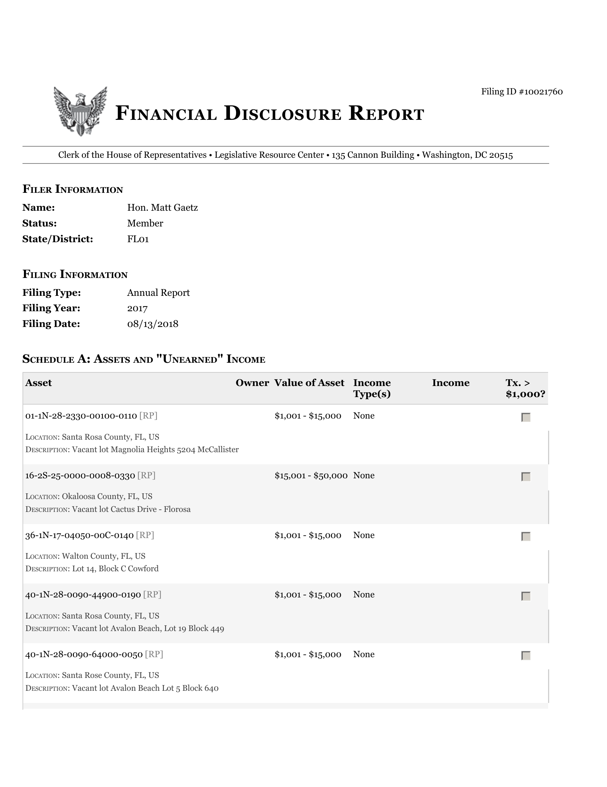
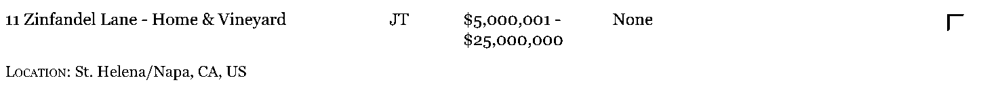
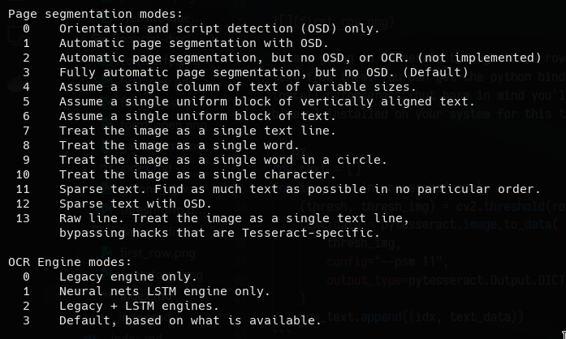
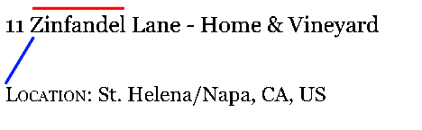
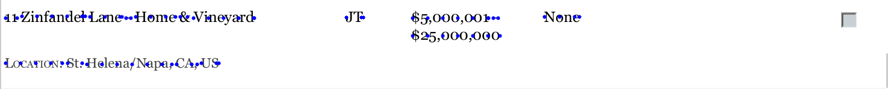
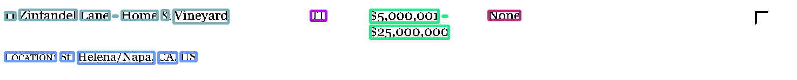

+++
title = "Scraping financial discloure reports from the House of Clerks website with Python - Part 3: OCR with Tesseract and column clustering using AgglomerativeClustering"
description = "Part 3 of a series on acquring and scanning House of Clerks financal disclosures using Python. Covers extracting text from the forms and grouping them into columns using AgglomerativeClustering."
date = 2023-03-20
updated = 2022-03-20
draft = true

[taxonomies]
tags = ["Computer Vision","Python"]
[extra]
math = true
math_auto_render = true
comments = true
toc = true
+++

# Introduction

In the [previous](@/posts/financial-disclosure-p2/index.md) article I covered how to use contour detection and morphological operations (using `opencv`) to extract tables from the financial disclosure forms ready for text extraction.

The form we are working with is shown below: 



# Text extraction using tesseract

Continuing from where we left off in the last blog we should have an list contains the rows of the schedule A table. Since the list is sorted by y coordinate the first element should be the below image:



We are going to enumerate through these rows using `tesseract` to extract text from them. You can get the python bindings for tesseract via `pip install pytesseract` but bare in mind you'll still need tesseract (the binary) installed on your system for this to work. 

```py
row_text = []
for idx, row in enumerate(rows):
    (thresh, thresh_img) = cv2.threshold(row, 160, 255, cv2.THRESH_BINARY)
    text_data = pytesseract.image_to_data(
        thresh_img,
        config="--psm 11",
        output_type=pytesseract.Output.DICT
    )
    row_text.append((idx, text_data))
```

We begin by enumerating - we want to hang onto an index so we can refer back to the original row if its needed later. `pytesseract` makes the next step super simple - simply calling it and passing our image as argument will do all the OCR for us. For information about the `psm` (and just to learn more about tesseract) run `tesseract --help-extra` from your terminal - the relavant bits are shown below.



The `psm` choice was made via trial and error between 11 and 12 as they seemed the most suitable. OCR engine was left as its default.

We now have a list of tuples, the first element being the index of the row and the second being a dictionary - we're interested in the following keys:

- `text` - an array of detected words.
- `conf` - how confident tesseract is about the detected word.
- `left`, `top`, `width`, `height` - coordinates defining the bounding box around each word.

To begin - we're going to return the bounding boxes of all the words that have a confidence exceeding a certain threshold.

```py
def filter_coords(t_dict, thresh):
    zipped_coords = zip(t_dict["left"], t_dict["top"], t_dict["width"], t_dict["height"])
    zipped_conf = zip(t_dict["conf"], zipped_coords)
    filtered_coords = []
    for idx, v in enumerate(zipped_conf):
        (conf, coords) = v
        if conf > thresh:
            filtered_coords.append((idx, coords))
        else:
            continue
    return filtered_coords
```
Since all the array in our tesseract dictionary are matched by index we zip up our confidences and bounding boxes. We then loop through all the words, only returning those with `conf > thresh`. We also attach an index - this is needed to refer back to the `text` key in our dictionary later.

Calling it on the first row like `filter_coords(row_text[0][1], 2)` will return something like
```
[(4, (9, 23, 19, 14)),
 (5, (36, 18, 105, 19)),
 (6, (149, 20, 53, 17))...
 (7, (209, 29, 8, 2))]
 ```
 We now have a list of bounding boxes and the words the indexes of the words the relate to. We are almost ready to begin column clustering.

 # Preprocessing for clustering - adding data points

 Lets look at the first row again.
 
 

 The output of this should be 5 clusters:
 - 11 Zinfadel Lane - Home & Vinyard
 - JT
 - $5,000,00,1-$25,000,000
 - None
 - Location: St. Helena/Napa, CA, US

 It's very obvious to us which cluster each word belongs to, and we can add some data points to make it obvious to the clustering model as well. We have the bounding boxes surrounding the words, but if we try and train a model using those data points we'll end up with an issue as shown below:

 

The length of the word "Zinfadel" (red line) exceeds the distance between its bottom left coordinate and the top right coordinate of the word "Location" (blue line). This means our clustering model is likely to put them in the same cluster. Bounding boxes are clearly not enough here.

Lets look at the image again. Whats the largest distance between two data points where we would still expect them to be in the same cluster? For the above row it appears to be he vertical spacing between the two prices. Another point to note is that the words are thin - so thin that their height is irrelevant from a clustering perspective. This means we can start thinking about things in terms of centroids instead of bounding boxes. The code and image below shows how these two observations can be tied together to enrich our training data:

 

We've filled our words with data points - the spacing has been picked to roughly match the vertical spacing between the two prices. A single-linkage based hierarchal clustering algorithim will associate all the points within a word to the same cluster if we pick a linkage distance equal to our point spacing. I'll talk more about this in the clustering section.

The below function can be used to superimpose points of distance `point_spacing` on top of our words:
```py
def fill_word_with_points(word_coords, point_spacing):
    points = []
    i = 0
    for (ind, fcoord) in filtered_coords:
        (x, y, w, h) =  fcoord
        centre_points = [(ind, (x, y + h/2)) for x in np.arange(x, x + w, point_spacing)]
        centre_points.append((ind, (x + w, y + h/2)))
        points.extend(centre_points)
    return points
```
This function takes the bounding boxes of all the words and generates points by setting their y coordinates to `y+h/2` (halfway up the word) and their x coordinate to a point in the range `np.arange(x, x+h, point_spacing)` - i.e. each x coordinate will be `point_spacing` distance apart. We manually append the rightmost point on the word to account for scenarios where the distance between the rightmost point from `np.arange` and the leftmost point in the next word are greater than our point spacing. The index `ind` is once again being returned so we have a link back to the original word.

We then apply the function each row of our form, filtering out low confidence words with our `filter_cord` function. We also save an image, one for each row, showing the row with the data points superimposed on top.
```py
point_spacing = 25
row_points = []
for idx, tdata in row_text:
    filtered_coords = filter_coords(tdata, 2)
    word_points = fill_word_with_points(filtered_coords, point_spacing)
    point_cds = [np.array([x, y]) for (_,(x,y)) in word_points]
    a = rows[idx].copy()
    row_points.append(word_points)
    for (x, y) in point_cds:
        cv2.circle(a, (int(x), int(y)), 0, (0,0,255), 5)
    si(a, f"../outputs/tmp/{idx}.png")
```

The images should be like the one shown earlier, with a row from the table and the corresponding added data points.

# Clustering - model training

We are now able to train a clusteing model on our enriched dataset. As discussed earlier we added data points in such a way to support single-linkage hierarchal clustering. Using sklearn such a model can be initialized by (docs [here](https://scikit-learn.org/stable/modules/generated/sklearn.cluster.AgglomerativeClustering.html)):
```py
from sklearn.cluster import AgglomerativeClustering

clustering = AgglomerativeClustering(
    linkage="single",
    affinity="euclidean",
    distance_threshold=distance_threshold,
    n_clusters=None
)
```
- `linkage` - single means we will build up clusters by looking at the minimum distance between observations in two clusters to determine whether to merge the clusters. If the minimum distance is < `distance_threshold` then the clusters merge.
- `affinity` - Distance metric used - `euclidean` makes sense based on how we've enriched our data.
- `distance_threshold` - As mentioned, distance (as defined by our affinity) below which two clusters will be merged.
- `n_clusters` - If you know how many clusters there should be, you can supply the model with that information beforehand. The forms we are scanning have different numbers of elements in different tables/rows so we cannot supply this parameter.

We need to determine a distance threshold. In the last section we filled all the words in our dataset with points of spacing 30. We know that all points we want to merge into the same cluster are at most 30 distance apart. With this information we can just set this distance to 31 to ensure the clustering algorithim merges the points within a word.

The below code will compute the clusters for our row and zip our clusters up with their respective data points. We then construct a dictionary where the keys are the cluster labels and the values are the coordinates and word indices in the cluste.

```py
from sklearn.cluster import AgglomerativeClustering
from itertools import groupby

clustering = AgglomerativeClustering(
    distance_threshold=31,
    affinity="euclidean",
    linkage="single",
    n_clusters=None
)
coords = [(x, y) for (_, (x, y)) in row_points[0]]
cluster_mapped = clustering.fit_predict(coords)
groupingkey = lambda x: x[0]
zipped_labels = list(zip(cluster_mapped, row_points[0]))
zipped_labels.sort(key=groupingkey)
cluster_groups = groupby(zipped_labels, groupingkey)
cluster_dict = {
    k: list(map(lambda x: x[1], v)) for k, v in cluster_groups
}
for k, v in cluster_dict.items():
    print(f"{k}: {len(v)} elems in cluster")
```
The print statements should so something like:

```
0: 3 elems in cluster
1: 14 elems in cluster
2: 2 elems in cluster
3: 18 elems in cluster
4: 23 elems in cluster
```

Which is useful for playing with different hyperparameters - we know there should only be 5 clusters for this row.


```py
word_clusters = []
d = row_text[0][1]
for (cluster, coord) in zipped_labels:
    index = coord[0]
    word_clusters.append((cluster, index))
    
clusters_indices = list(set(word_clusters))
clusters_indices.sort(key=lambda x: x[1])
clusters_words = [(cluster, d["text"][i]) for (cluster, i) in clusters_indices]
clusters_coords = [
    (cluster, (d['left'][i], d['top'][i], d['width'][i], d['height'][i]))
     for (cluster, i)
     in clusters_indices
]

clusters_words.sort(key=groupingkey)
```

```py
copyrow = thresh_img_row.copy()
for (cluster, coord) in clusters_coords:
    np.random.seed(cluster)
    color = [int(c) for c in np.random.randint(0, 255, size=(3,), dtype="int")]
    (x,y,w,h) = coord
    cv2.rectangle(copyrow, (x, y), (x+w, y+h), color, 3)

        
si(copyrow)
```

 
